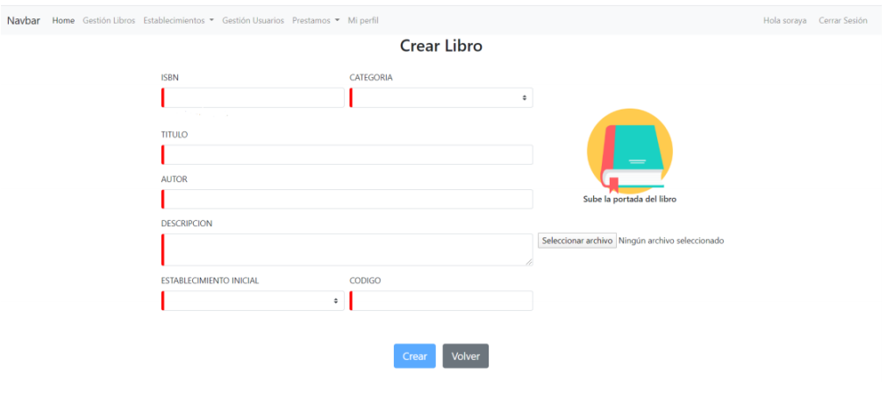
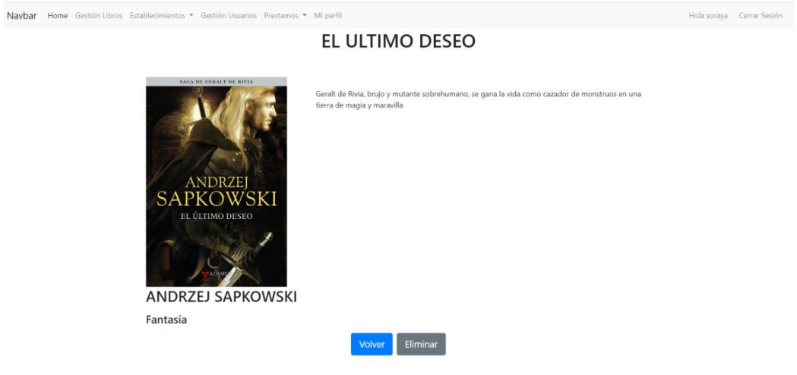

<p align="center"></p>

# Córdoba Bookcrossing 

Este proyecto fue realizado como trabajo de Fin de Ciclo para el Grado Superior de Desarrollo de Aplicaciones Web y está basado en el movimiento Bookcrossing. 

## Objetivo

El objetivo del proyecto era poner en práctica mis conocimientos sobre framework Laravel visto en clase de Desarrollo de Aplicaciones en Entorno Servidor y aprender un framework nuevo en la parte de front. Para ello decidí escoger Angular.

## ¿Qué es el bookcrossing?

Es la práctica de dejar libros en lugares públicos para que los recojan otros lectores, que después harán lo mismo. La idea es liberar libros "en la jungla" para que sean encontrados por otras personas. 

## ¿En qué consiste el proyecto?

Basándome en el movimiento Bookcrossing, diseñé un sistemas de gestión de bibliotecas descentralizadas. 

Varios establecimientos de la ciudad se podían registrar como centro colaborador del movimiento, ofreciendo su espacio para el intercambio de libros. 

El sistema era el siguiente, un usuario se registra en la aplicación y puede ver los establecimientos colaboradores y los libros que se encuentran en dicho establecimiento. Una vez en el establecimiento, uno de los empleados le presta el libro, por lo que el libro deja de estar disponible. Una vez terminado el libro, no es necesario que el usuario acuda al mismo establecimiento para devolver el libro, puede hacerlo en cualquiera de los establecimientos colaboradores. 

Desde la aplicación se puede seguir la trazabilidad del libro, valorar un libro, dejar un comentario o ver el ranking de libros más valorados. 

## Configuración y puesta en marcha

### Laravel

Para arrancar el servidor de Laravel:
```bash
php artisan serve
```

### Angular

Para arrancar el servidor de Angular:
```bash
ng serve
```

## Algunas capturas

### Crear libro




### Ficha libro



